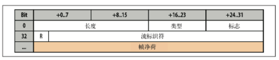

---

# 常用定义
title: "Web性能权威指南阅读笔记"           # 标题
date: 2019-03-23T10:01:23+08:00    # 创建时间
lastmod: 2019-03-23T10:01:23+08:00 # 最后修改时间
draft: false                       # 是否是草稿？
tags: ["web", "performance"]  # 标签
categories: ["tech"]              # 分类
author: "zhouxwyeah"                  # 作者
description: "web性能权威指南note，我们可以了解影响web性能中的网络
协议、应用、浏览器等因素细节，以及通用的解决办法"
# 用户自定义
# 你可以选择 关闭(false) 或者打开(true) 以下选项
comment: true   # 关闭评论
toc: true       # 关闭文章目录
# 你同样可以自定义文章的版权规则
reward: false	 # 关闭打赏
mathjax: true    # 打开 mathjax
---

以下笔记来自[web性能权威指南](https://book.douban.com/subject/25856314/)

### 网络

#### 延迟

延迟才是性能的关键，大部分时候带宽都不是瓶颈，任何时候，网络传输的性能都是不能忽略的。

客户端到服务端延时时长 = 传播延时（取决于距离） + 传输延时（带宽） + 处理延时（路由器处理） + 排队延时（接收方缓存区排队）

光的传播一般都不是直线的，需要折射传播，对应的折射率大概为1.5倍   1000KM的RTT大概为10MS，对于某些延迟敏感的应用来说，也是一个很大的数字了。

#### TCP协议

* 连接

TCP是我们日常使用最多的协议，谈论WEB性能不可能脱离TCP，理解TCP某种程度来说是对于WEB的必修课。

众所周知，TCP连接需要经过三次握手，客户端服务端交换数据之前，确认起始分组序列号，由两端随机生成：

因此我们可以看出，TCP传输数据之前，都需要经过一轮完整的RTT，了解延迟的影响我们知道，这个过程对于性能的影响因素是很难忽略的，因此后续对于影响延迟的重要因素，都有对应的优化手段。

连接的过程需要很长的时间消耗，因此，复用连接也是很多系统的优化手段之一，所以我们在网络框架中，经常可以看到连接池的出现。

* 流量控制

TCP中有很多机制，可以控制双向的数据流的速度，比如流量控制、拥堵控制、拥堵预防机制。

TCP双方建立连接时，都会发送rwnd来定义接受不了窗口大小。每个ACK都会携带rwnd,以便双方调整速率，较小的那个影响速率，但是因为TCP规范分配给rwnd的字段只有16位，最大值为65536字节，这样无法达到最优性能，为了解决这个问题RFC1323提供了窗口缩放，最大可为1bytes.

`		sysctl net.ipv4.tcp_window_scaling`
`	sysctl -w net.ipv4.tcp_window_scaling=1`

确认了发送窗口大小，但是实际的网络条件会复杂的多，为了更好的更平滑的应对网络情况，需要有一套机制去动态调整适应，TCP规范中提出了 慢启动、 拥堵预防、快速重发、快速恢复等算法

但因此慢启动和连接握手往往成为了网络开销的大头，所以增大TCP初始的拥塞窗口变成了优化的一个收到，目前cwnd 为10段 1W10.

当发生了丢包，拥塞预防算法也是重要的，他可以根据丢包反馈机制调整传输窗口到合理的大小。

* 带宽延迟积
* 队首堵塞

每个TCP分组都带有唯一的序列号，而且所有分组都要按照顺序发送给接收端，如果分组中任意分组没能达到接受要求，数据都保持在接受不了区TCP的缓存区，等待其他分组的到来。 之后才能处理数据，应用端会感觉到延迟，这种效应称为Head of Line，队首阻塞 

队首阻塞带来的好处的是应用程序不用关系重排和重组，但是也会付出代价，比如抖动。

* 优化
  * 服务器配置调优  增加初始拥堵窗口大小   fastopen 
  * 内核最新版本
  * 确保cwnd为10
  * 禁用空闲慢启动
  * 减少数据传输冗余
  * 减少RTT
  * 尽量重用连接

#### UDP

* 无协议服务

UDP协议仅仅在IP协议报文的基础上，增加了源端口，目标端口、分组长和校验和，而且源端口和校验和都是可选的，提供了一个应用程序多路复用机制；

​	不保证消息交付/交付顺序/连接状态/拥堵控制

* UDP和NAT

每个NAT设备维护一个表，表中包含本地IP和全球IP的映射，私用网络采用保留IP段

* 优化建议

  从协议层面，UDP完成的事情很少，大部分需要应用程序帮助：

  * 应用程序控制传输速度
  * 应用程序
  * 应用程序控制丢包
  * 应用程序可以使用keep-alive
  * 应用程序应用不发送数据大于MTU的数据包

### TLS

SSL由TCP上层应用层来实现，正确使用SSL的情况下，第三方只能推测出连接的端点，加密类型，发送频率和大致数量。

TLS的目标：

* 加密  混淆数据机制
* 身份验证 验证十分标识有效性的机制
* 完整性 检测消息是否被篡改或者伪造的机制

关于加密，连接双方需要针对加密的密钥套件和密钥协商一致，这也就是所谓的**"TLS握手"**，同时，更严格的双向认证要求，经常出现在金融级别的认证之中。同时，通过MAC可以验证消息的完整性。

TLS握手，从图中可以看出，需要3次RTT

* 应用层协议协商 ALPN

作为TLS的扩展，允许应用双方在TLS握手阶段完成协议的协商

* 服务器名称指示

当一个IP想为多个主机服务时，SNI扩展被引入TLS协议，允许客户端握手之初指定要连接的主机名。WEB服务可以检查SNI主机名，选择适当的证书，以完成握手

 * 信任链和证书颁发机构，浏览器什么时候信任谁
    * 手工指定证书
    * 证书颁发机构 CA，可以提前安装根证书
    * 操作系统和浏览器内置颁发机构
* 证书撤销
  * CRL 证书撤销名单，需要定期更新，不能保证时效性；每个客户端需要保存完整的一份
  * OCSP  提供一种实时检查证书的机制，需要CA支持
* 优化建议
  * 计算成本 一般需要专门硬件来完成SSL卸载
  * 尽早完成握手 3RTT
  * TLS会话恢复 可以减少一次RTT，节省掉协商公钥和加密算法协商
  * 开启压缩
  * 控制证书链长度
  * 提升TCP性能，更新TLS库、去掉不必要的证书链

####无线

#### wifi

#### 移动网络

#### 优化建议

### HTTP

> 作为被采用的最多的协议，我们来看看他们的优化做法。现代WEB应用，都有大量的链接、静态资源。用户需要感觉很快，需要响应在100ms以内。经过分析性能瀑布，我们查看HTTP请求的性能分布。一个HTTP请求，都由多个独立的阶段构成，DNS解析、TCP链接握手、TLS协商（必要时），发送HTTP请求，然后接受应答内容。分析性能瀑布可以看出，限制WEB性能的主要因素还是客户端和服务端之间的延迟。
>
> 大部分HTTP数据流是小型突发数据流，而TCP则是为持久化链接和大块数据优化，网络RTT成为了TCP吞吐量金额性能的限制因素。
>
> * 基于文档的优化
> * 推测性性能优化 资源预取、DNS预解析、TCP预链接、页面预渲染

#### HTTP1.1

* KEEP-ALIVE，减少RTT
* 多个TCP链接
* 连接与拼合 CSS 图片
* HTTP管道

#### HTTP2

HTTP2.0通过支持首部字段压缩和在同一链接上发送多个并发消息，让应用更有效的利用网络资源，减少感知的延迟时间。

HTTP2.0性能增强的核心，全在于新增的二进制分帧层

HTTP1.X以换行符作为纯文档，而HTTP2.0将所有传输分割成更小的消息和帧

* 二进制分帧
  * DATA
  * HEADERS
  * PRIORITY
  * RST_STEAM
  * SETTINGS
  * PUSH_PROMISE
  * PING
  * GOWAY
  * WINDOW_UPDATE
  * CONTINUATION
* 连接多路复用，可以并行的发送请求和响应，互不干涉，消除不必要的延迟
* 消息是指逻辑上的HTTP消息，由一序列帧组成

HTTP1.* 的交付模型中，每个连接每次只交付一个响应，这样也会造成队首阻塞，从而造成TCP链接效率低下，TCP的帧互不依赖，可以乱序发送，然后服务端组装。

* 请求优先级 每个流都可以带一个31比特的优先值
* 每个来源一个链接
  * 优点
  * 所有数据流油咸次序一致
  * 压缩上下文单一，效果更好
  * TCP链接减少，从而使网络拥塞状况得以改观
  * 慢启动减少，拥塞和丢包恢复更快
  * 缺点
  * 依然有TCP的 HOL
  * TCP缩放依然影响吞吐量
* 流量控制
* 服务端推送
* 头部压缩
* HTTPS有效的APNL，方便升级和发现

#### 优化建议

* 减少DNS查找
* 复用连接
* 减少重定向
* 使用CDN
* 去除不必要的资源
* 客户端缓存
  * Cache-Control
  * Last-Modified + Etag
* 压缩传输内容
* 消除不必要的字节，监控头部和cookies
* 并行处理请求和响应
* HTTP1.1
  * 利用管道
  * 域名分区，充分利用浏览器单域名6个链接的特性
  * 打包资源，减少请求数
  * 嵌入小资源，减少请求数量
* HTTP2.0
  * tcp tls实现最佳 cwnd为10分组 APNL TLS
  * 去除1.1的优化
  * 双协议支持
  * PSOL
  * 负债设备支持2.0

### 浏览器和协议

#### 浏览器

* 连接管理和优化
* 安全沙箱
  * 连接限制
  * TLS协商
  * 同源策略
* 缓存策略
* 应用和协议支持

#### AJAX

* CORS
* 数据类型
  * ArrayBuffer 固定长度的二进制数据缓冲区。 
  * Blob 二进制大对象或不可变数据。 
  * Document
     解析后得到的 HTML 或 XML 文档。 
  * JSON
     表示简单数据结构的 JavaScript 对象。 
  * Text 简单的文本字符串。 
* 事件

#### websocket

websocket实现客户端和服务端双向、基于消息的文本或者二进制数据传输，他是浏览器中最靠近套接字的API，还提供了

•连接协商和同源策略;
• 与既有 HTTP 基础设施的互操作;
• 基于消息的通信和高效消息分帧;
• 子协议协商及可扩展能力。

> WebSocket 是浏览器中最通用最灵活的一个传输机制，其极简的 API 可以让我们在客
> 户端和服务器之间以数据流的形式实现各种应用数据交换(包括 JSON 及自定义的
> 二进制消息格式)，而且两端都可以随时向另一端发送数据

自定义数据交换协议，需要自身取完成状态管理、压缩、缓存和其他原来浏览器提供给的服务。

WebSocket 协议对每条消息的格式事先不作任何假设:仅用一位标记消息是文本还是 

二进制，以便客户端和服务器有效地解码数据，而除此之外的消息内容就是未知的。 

此外，与 HTTP 或 XHR 请求不同——它们是通过每次请求和响应的 HTTP 首部来 沟通元数据，WebSocket 并没有等价的机制。因此，如果需要沟通关于消息的元数 据，客户端和服务器必须达成沟通这一数据的子协议。 

> WebSocket 资源 URL 采用了自定义模式:ws 表示纯文本通信(如 ws://example. com/socket)，wss 表示使用加密信道通信(TCP+TLS)。为什么不使用 http 而要自 定义呢? 
>
> WebSocket 的主要目的，是在浏览器中的应用与服务器之间提供优化的、双向通信机 制。可是，WebSocket 的连接协议也可以用于浏览器之外的场景，可以通过非 HTTP 协商机制交换数据。考虑到这一点，HyBi Working Group 就选择采用了自定义的 URL 模式。 
>
> WebSocket 通信协议(RFC 6455)包含两个高层组件: 
>
> 开放性 HTTP 握手用于协商连接参数，二进制消息分帧机制用于支持低开销的基于消息的文本和二进制数据传输。

 

•帧 最小的通信单位，包含可变长度的帧首部和净荷部分，净荷可能包含完整或部分 应用消息。 

• 消息 一系列帧，与应用消息对等 

> WebSocket 很容易发生队首阻塞的情况:消息可能会被分成一或多个帧，但不同 
>
> 消息的帧不能交错发送，因为没有与 HTTP 2.0 分帧机制中“流 ID”对等的字段 (参见 12.3.2 节“流、消息和帧”)。 
>
> 显然，如果一个大消息被分成多个 WebSocket 帧，就会阻塞其他消息的帧。如果 你的应用不容许有交付延迟，那可以小心控制每条消息的净荷大小，甚至可以考 虑把大消息拆分成多个小消息! 
>
> WebSocket 不支持多路复用，还意味着每个 WebSocket 连接都需要一个专门的 TCP 连接。对于 HTTP 1.x 而言，由于浏览器针对每个来源有连接数量限制，因此 可能会导致问题(参见 11.3 节中的“消耗客户端和服务器资源”)。 

* 使用场景和性能

websocket api提供一个简单的接口，能够在客户端和服务端实现基于消息的双向通信。

 * XHR 事物性请求响应，不支持请求流

 * SSE 客户端握手后不发送数据

   

   
   * 消息开销  2-14字节的帧封装 
   * 基础设施
   * 性能检查
     * 使用安全的WebSocket
     * 关注钩子脚本性能
     * 利用子协议协商确认应用协议
     * 优化二进制最小化传输
     * 监控客户端缓存数据
     * 切分应用避免队首阻塞

####webrtc

